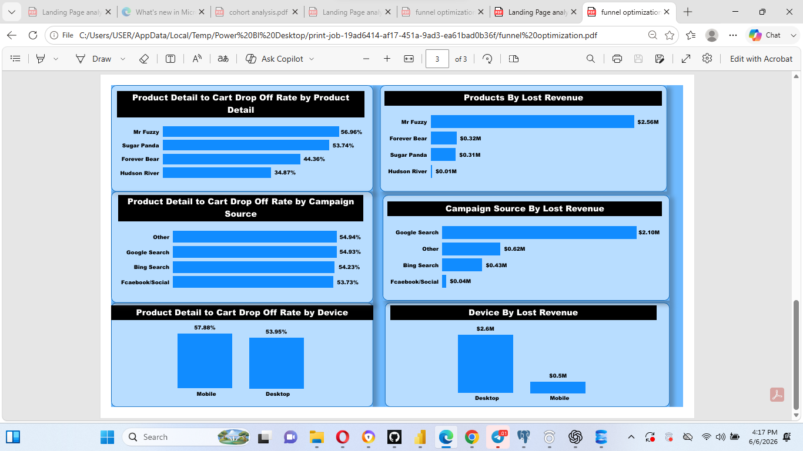

# Funnel Optimization Analysis
SQL • Power BI • Funnel Analysis • Conversion Rate Optimization

---

## Overview
This project analyzes the full customer purchase journey for an e-commerce platform (Mr Fuzzy Teddy Bear Store), from landing page entry through checkout. It identifies exactly where users drop off, which segments are most affected, and how much revenue is recoverable by fixing the biggest leaks.

---

## Data Source
This project uses a public dataset from Maven Analytics as part of a data analytics challenge.

Source: https://www.mavenanalytics.io/data-playground

---

## Business Problem
In the 2012–2013 e-commerce dataset for **Mr Fuzzy Teddy Bear Store**, landing pages had inconsistent bounce and conversion performance, and the purchase funnel showed a major drop-off between Product Detail and Cart — both of which were causing significant, unquantified revenue leakage.

---

## Objectives
- Measure landing page performance (bounce rate, conversion rate) and identify the strongest-performing page
- Map the full purchase funnel and pinpoint the largest drop-off stage
- Segment funnel and landing page performance by product, device, and traffic source
- Estimate revenue lost to bounce rate and funnel drop-off
- Model the revenue opportunity from a realistic conversion lift

---

## Tools & Technologies
- SQL → Data extraction, cleaning, joins, funnel staging
- Excel → Data validation
- Power BI → Dashboards, funnel visualization, segmentation, DAX measures
- Analytics Methods → Funnel Analysis, Segmentation, ROI Estimation

---

## Core Skills Demonstrated
- SQL data transformation and funnel structuring
- Power BI dashboard development and DAX measures
- Statistical validation (Chi-square test, hypothesis testing)
- Funnel optimization and conversion rate analysis
- Segmentation analysis (product, device, traffic source)
- Business impact estimation and revenue modeling

---

## Solution Approach

### 1. Landing Page Performance Analysis
Cleaned and joined session-level data in SQL, validated it in Excel, then ran a Chi-square test to confirm whether differences in landing page performance were statistically significant. Built a Power BI dashboard tracking total visits, bounce rate, and conversion rate by page, device, and campaign source.

### 2. Funnel Analysis
Built a complete customer journey funnel in SQL:

Landing → Product Page → Product Detail → Cart → Shipping → Billing → Purchase

### 3. Segmentation Analysis
Drop-off and lost revenue were broken down across:
- Product types
- Device type
- Campaign traffic sources

### 4. Revenue & Opportunity Modeling
Quantified lost revenue at each leak point and modeled the financial impact of a 10% conversion lift at the biggest drop-off stage.

---

## SQL Data Preparation (Sample)

```sql
funnel AS (
SELECT 
    DISTINCT website_session_id,

    MAX(CASE WHEN pageview_url IN (
        '/home','/lander-1','/lander-2','/lander-3','/lander-4','/lander-5'
    ) THEN rn END) AS landing,

    MAX(CASE WHEN pageview_url = '/products' THEN rn END) AS product,

    MAX(CASE WHEN pageview_url IN (
        '/the-birthday-sugar-panda',
        '/the-forever-love-bear',
        '/the-hudson-river-mini-bear',
        '/the-original-mr-fuzzy'
    ) THEN rn END) AS product_detail,

    MAX(CASE WHEN pageview_url = '/cart' THEN rn END) AS cart,

    MAX(CASE WHEN pageview_url = '/shipping' THEN rn END) AS shipping,

    MAX(CASE WHEN pageview_url IN ('/billing','/billing-2') THEN rn END) AS billing,

    MAX(CASE WHEN pageview_url = '/thank-you-for-your-order' THEN rn END) AS purchase

FROM step 
GROUP BY 1
)
```

[View live funnel SQL code for Power BI reporting](SQL/Main-Funnel-Code.sql)

---

## Insights Dashboard View


Funnel Optimization


## Funnel Segmentation



---

## Key Metrics & Findings

### Landing Page Performance
- Total Visits: **473K**
- Bounce Rate: **44.76%**
- Conversion Rate: **6.83%**
- Orders: **32.31K**
- Revenue: **$2.63M**
- Top-Converting Page: **Lander 5 (10.17% conversion, 36.87% bounce)**
- Estimated Revenue Loss on Bounce Rate: **$1.18M**

### Funnel Performance
- Product Detail Reach: **210.21K**
- Cart Reach: **94.95K**
- Users Lost: **115.3K**
- Drop-off Rate: **54.83%**
- Average Order Value: **$81.29**
- Total Revenue: **$2,626,812**
- Estimated Revenue Loss: **$3.19M**

### Product-Level Drop-off (Product Detail → Cart)
- Mr Fuzzy: **56.96%** ($2.56M lost revenue)
- Sugar Panda: **53.74%** ($0.31M lost revenue)
- Forever Bear: **44.36%** ($0.32M lost revenue)
- Hudson River: **34.87%** ($0.01M lost revenue)

### Campaign Source Impact
- Other: **54.94% drop-off** ($0.62M lost revenue)
- Google Search: **54.93% drop-off** ($2.10M lost revenue)
- Bing Search: **54.23% drop-off** ($0.43M lost revenue)
- Facebook/Social: **53.73% drop-off** ($0.04M lost revenue)

### Device Performance
- Mobile: **57.88% drop-off** ($2.6M lost revenue, desktop)
- Desktop: **53.95% drop-off** ($0.5M lost revenue, mobile)

### Cart Abandonment Impact
- Lost Users From Cart Stage: **115,261**
- Lost Orders: **39,224**
- Potential Lost Revenue: **$3,188,619**

---

## Business Impact & Recommendations

A **10% improvement in Product Detail → Cart conversion** could generate:
- **$581,543 additional revenue**
- **7,154 additional orders**
- **21,021 additional users converted**

---

## Key Insights
- Major funnel leakage occurs at the Product Detail → Cart stage, losing over half of engaged users
- Mr Fuzzy products and Google Search traffic are the highest-value drop-off points, representing the bulk of recoverable revenue
- Mobile users drop off at a meaningfully higher rate than desktop users, pointing to a mobile UX gap
- Lander 5 statistically outperforms every other landing page on both bounce and conversion rate

---

## Recommendations
- Improve Product Detail page UX (images, reviews, pricing clarity) — especially for Mr Fuzzy
- Optimize the Google Search landing experience through A/B testing
- Prioritize mobile checkout flow improvements given the higher mobile drop-off
- Implement cart abandonment recovery strategies (email/SMS incentives)
- Reallocate traffic toward Lander 5's design pattern across other landing pages

---

## Overall Business Impact
- Landing page optimization opportunity: **$1.18M**
- Funnel drop-off revenue loss: **$3.19M**
- Conversion lift opportunity (10%): **$581K additional revenue**

---

## Conclusion
This project demonstrates the ability to transform raw session-level data using SQL, validate findings statistically, build KPI-driven dashboards in Power BI, and translate funnel behavior into clear, revenue-focused business recommendations.

---

## 🤝 Open to Opportunities

I am actively seeking opportunities in:

- Data Analyst roles (Entry-Level / Graduate / Junior)
- Healthcare Analytics roles
- Business Intelligence (BI) Analyst positions
- Data Engineering Internships
- Graduate Trainee Programs

I am open to remote, hybrid, and on-site opportunities where I can contribute to data-driven decision-making and continue developing technical expertise.

---

## 📬 Contact

**Ike Ernest**
Data Analyst | SQL | Power BI | Healthcare Analytics

- GitHub: [github.com/ikeernest4700-lab]
- LinkedIn: [https://www.linkedin.com/in/emeka-ike-108748198](https://www.linkedin.com/in/emeka-ike-108748198)
- Email: [ikeernest4700@gmail.com](mailto:ikeernest4700@gmail.com)

- Email: ikeernest4700@gmail.com
- Open to entry-level Data Analyst roles, collaborations, or feedback
